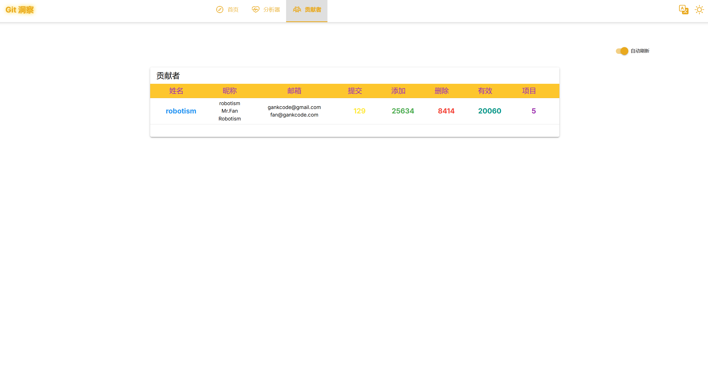

# gitinsight

## Usage


- gen config
```bash
gitinsight config gen
```

- config.yaml
```yaml
debug: false
server:
    address: 0.0.0.0:8080
    database:
        type: sqliteshim
        dsn: file:gitinsight.db
insight:
    auths:
        - domain: github.com
          username: robotism
          password: robotism
    repos:
        - url: https://github.com/robotism/gitinsight.git
          user: robotism
          password: robotism
    authors:
        - name: robotism
          email: robotism@robotism.com
          nickname: robotism
    reset: false
    cache:
        path: ./.repos
    interval: 15m
    since: ""

```

- docker

```bash


```

- docker-compose

```bash


```

## Screenshot


