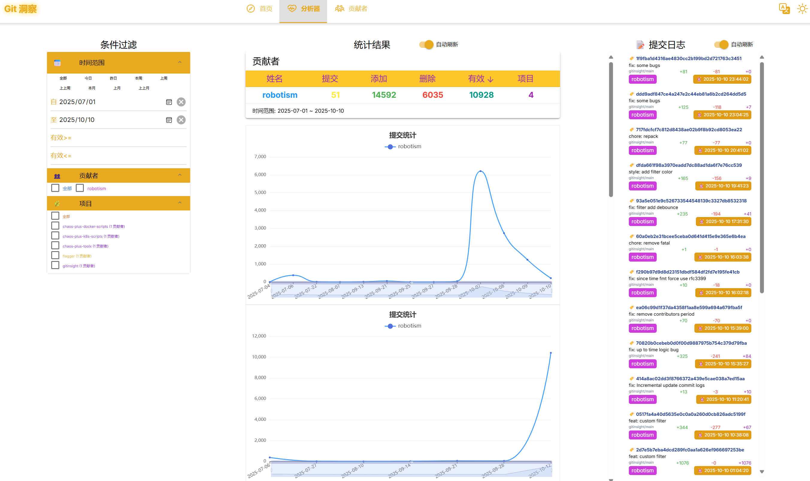

# gitinsight

## Usage


- gen config
```bash
gitinsight config gen
```

- config.yaml
```yaml
debug: false
server:
    address: 0.0.0.0:8080
    database:
        type: sqliteshim
        dsn: file:gitinsight.db
insight:
    reset: false
    readonly: false
    parallel: true
    interval: 15m
    since: "2025-10-01T00:00:00+08:00"
    auths:
        - domain: github.com
          username: robotism
          password: robotism
    repos:
        - url: https://github.com/robotism/gitinsight.git
          user: robotism
          password: robotism
    authors:
        - name: robotism
          email: robotism@robotism.com
          nickname: robotism
    cache:
        path: ./.repos

```

- docker

> https://github.com/robotism/gitinsight/pkgs/container/gitinsight

```bash
# generate config
touch config.yaml
docker run --rm \
-v $(pwd)/config.yaml:/app/config.yaml \
ghcr.io/robotism/gitinsight:latest \
./gitinsight config gen -f /app/config.yaml 
# vim config.yaml

# run
docker run --rm \
-p 8088:8080 \
-v $(pwd)/config.yaml:/app/config.yaml \
-v $(pwd)/.repos:/app/.repos \
ghcr.io/robotism/gitinsight:latest

```

- docker-compose

```bash

services:

  gitinsight:
    image: 'robotism/gitinsight:latest'
    container_name: gitinsight
    restart: always
    volumes:
        - ${DATA}/gitinsight/config.yaml:/app/config.yaml
        - ${DATA}/gitinsight/.repo:/app/.repo
    ports:
        - '${PORT_GITINSIGHT}:8080'
```

## Screenshot





## License

MIT License
